作るもののイメージは付いたでしょうか。
次は課題を始める準備をしていきます。

まず、[この課題用のテンプレートリポジトリ](https://github.com/shinonome-inc/frontend-basic-2022-todoapp-template)を開き、画面中央の"Use This Template"を押します。
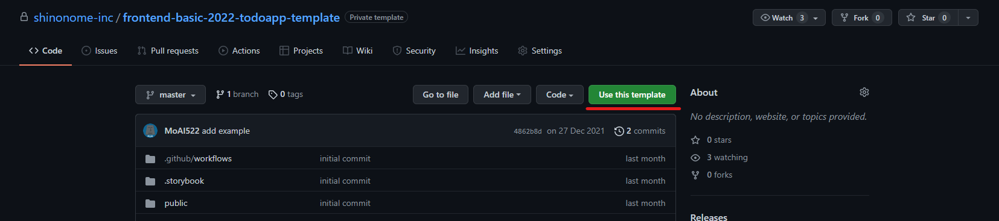

OwnerをあなたのGitHubアカウントにし、Repository nameを`<slack名>-frontend-basic-2022-todoapp`とします。
また、Publicのラジオボタンを選択してください。
そうしたら"Create repository from template"を押します。
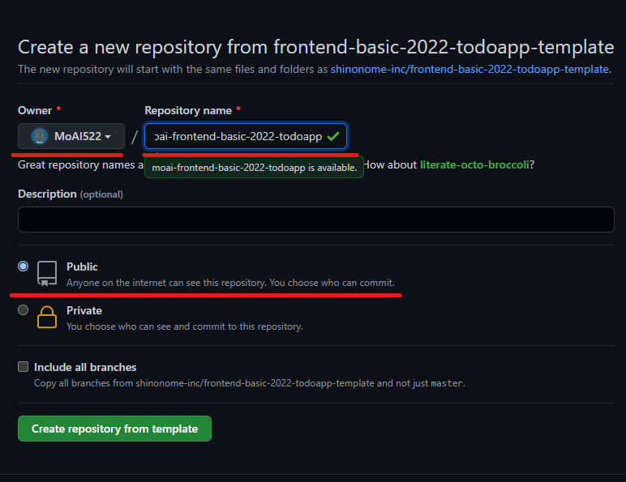

これで、あなたがこの課題を進めていくリポジトリができました。

次に、Chromaticの設定をしましょう。
[chromatic.com](https://www.chromatic.com/)にアクセスし、sign upを行います。これまで利用したことがある方は sign in を選択してください。
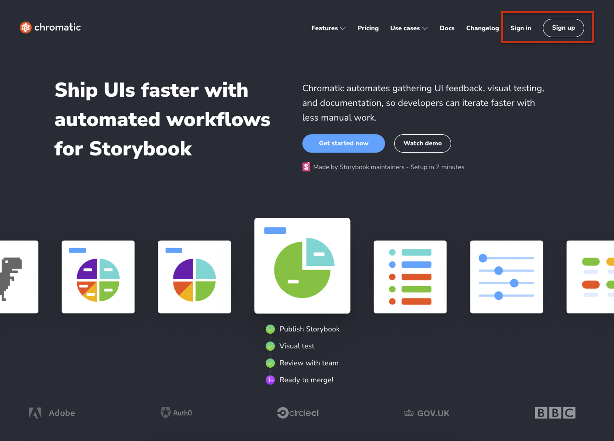

Connect with GitHub を選択し、githubアカウントとの連携を行います。
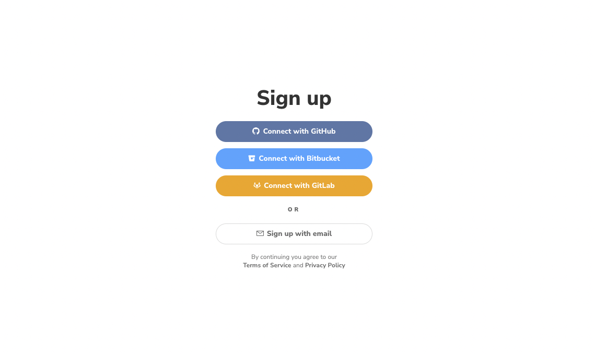

sing in/sign upが完了すると、以下のような画面になります。
左上が自分のアカウントになっていることを確認した上で、右上の **Add project** をクリックします。
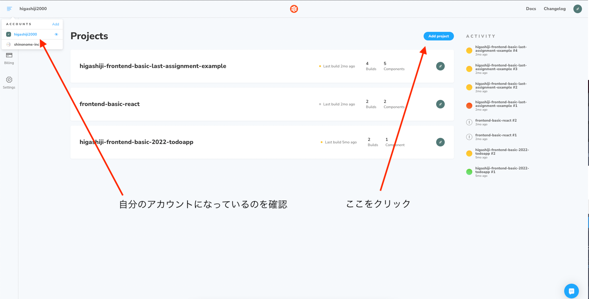

Add Projectの画面が開いたら、Choose from Github を選択します。
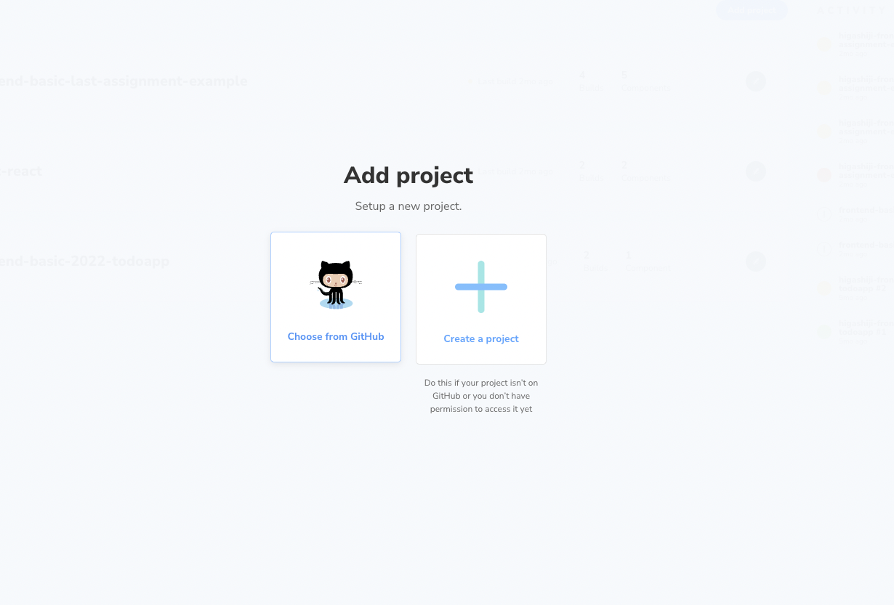

自分のリポジトリ一覧が表示されるので、先ほど作成したリポジトリを選択しましょう。
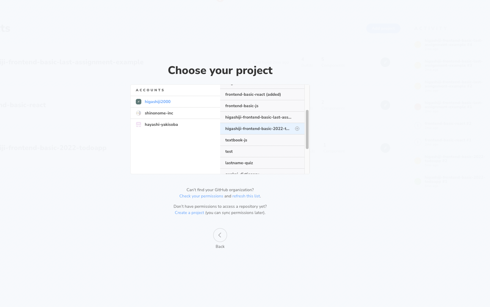

リポジトリを選択すると、以下のような画面になるので、 `project-token=`の先の部分(塗りつぶされている箇所)をコピーします。
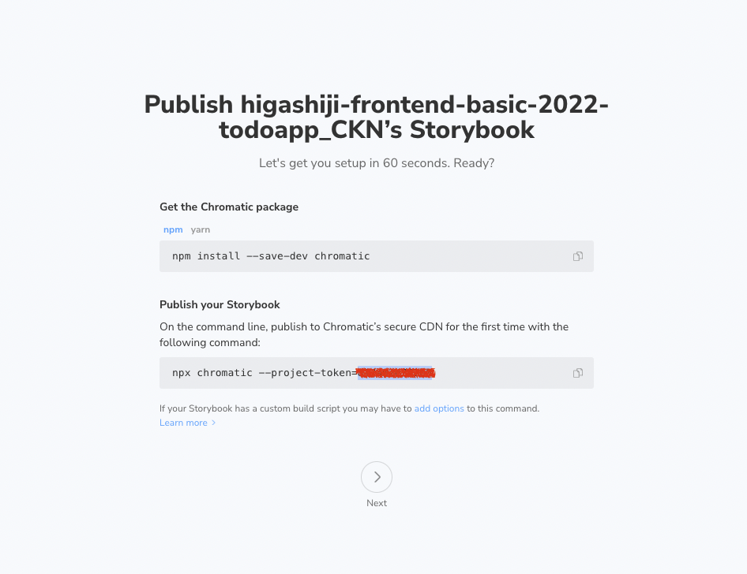

次に、先ほど作成したリポジトリの Settings タブの中、Security > Secrets > Actions を開きます。  
開けたら、右上の `New Repository Secrets` ボタンをクリックしてください。
Repository Secretsは、外部サービスとの連携のためのトークンなど機密情報を管理するための機能です。
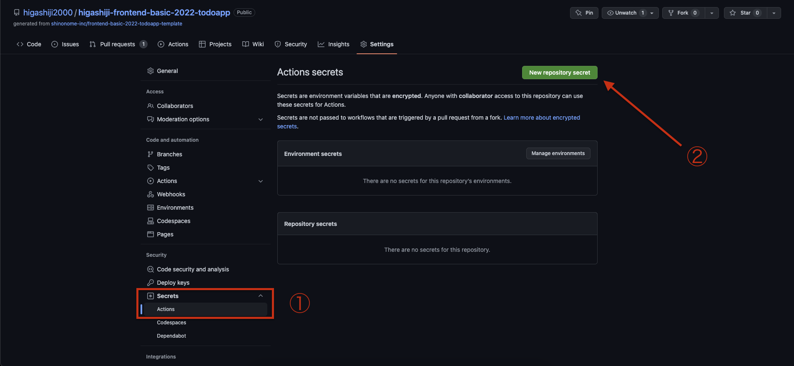

このリポジトリでは、pushするたびに`CHROMATIC_PROJECT_TOKEN`の値を読み取ってChromaticを動かす設定になっています。
先ほどコピーしたchromaticの`project-token`を`CHROMATIC_PROJECT_TOKEN`という名前で保存しましょう。
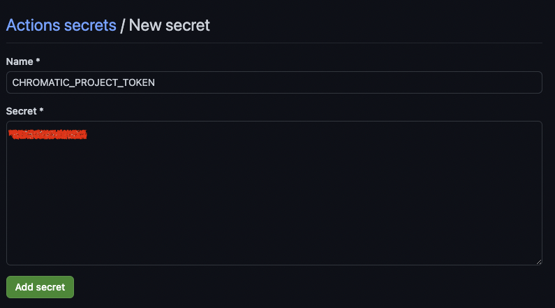

`Repository secrets`の欄に、`CHROMATIC_PROJECT_TOKEN`が追加されているのが確認できたら成功です。  
Chromaticの設定は以上になります。
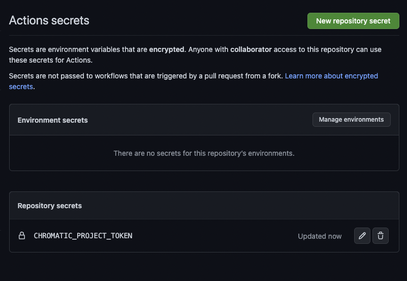

次に、リポジトリをローカルにクローンしましょう。

ここからは、HTML/CSS課題でNode.js等のインストールが済んでいる前提で進んでいきます。
まだの方や、この課題までの間にPCを変えた方はそちらをご確認ください。

リポジトリの直下で次のコマンド`yarn install`を実行します。

実行が完了したら続けて`yarn sb`を実行しましょう。これでStoryBookが表示され、
"This is example."を表示するコンポーネントを確認できたら、ひとまずローカルの環境の準備は完了です。
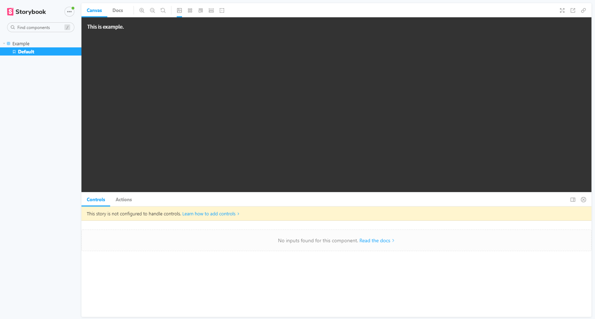
