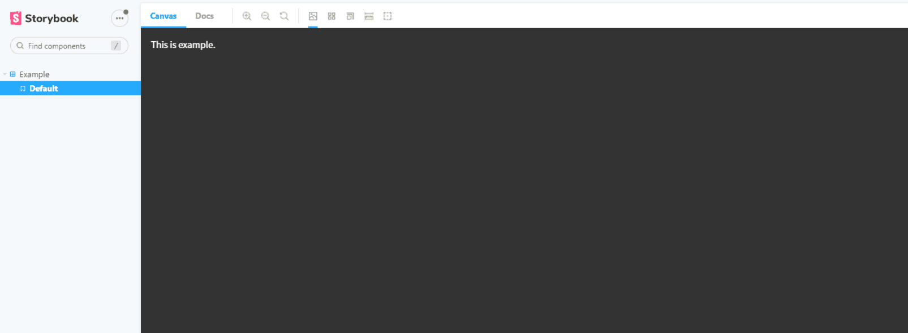
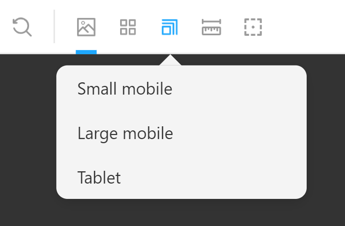
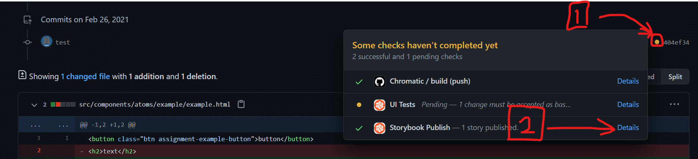

作るもののイメージは付いたでしょうか。
次は課題を始める準備をしていきます。

まず、[この課題用のテンプレートリポジトリ](https://github.com/shinonome-inc/frontend-basic-2022-todoapp-template)を開き、画面中央の"Use This Template"を押します。

OwnerをあなたのGitHubアカウントにし、Repository nameを`<slack名>-frontend-basic-2022-todoapp`とします。
また、Publicのラジオボタンを選択してください。
そうしたら"Create repository from template"を押します。

これで、あなたがこの課題を進めていくリポジトリができました。

次に、Chromaticの設定をしましょう。
[chromatic.com](https://www.chromatic.com/)にアクセスし、sign upを行います。これまで利用したことがある方は sign in を選択してください。

Connect with GitHub を選択し、githubアカウントとの連携を行います。

sing in/sign upが完了すると、以下のような画面になります。
左上が自分のアカウントになっていることを確認した上で、右上の **Add project** をクリックします。

Add Projectの画面が開いたら、Choose from Github を選択します。

自分のリポジトリ一覧が表示されるので、先ほど作成したリポジトリを選択しましょう。

リポジトリを選択すると、以下のような画面になるので、 `project-token=`の先の部分(塗りつぶされている箇所)をコピーします。

次に、先ほど作成したリポジトリの Settings タブの中、Security > Secrets > Actions を開きます。  
開けたら、右上の `New Repository Secrets` ボタンをクリックしてください。
Repository Secretsは、外部サービスとの連携のためのトークンなど機密情報を管理するための機能です。

このリポジトリでは、pushするたびに`CHROMATIC_PROJECT_TOKEN`の値を読み取ってChromaticを動かす設定になっています。
先ほどコピーしたchromaticの`project-token`を`CHROMATIC_PROJECT_TOKEN`という名前で保存しましょう。

`Repository secrets`の欄に、`CHROMATIC_PROJECT_TOKEN`が追加されているのが確認できたら成功です。  
Chromaticの設定は以上になります。

次に、リポジトリをローカルにクローンしましょう。

ここからは、HTML/CSS課題でNode.js等のインストールが済んでいる前提で進んでいきます。
まだの方や、この課題までの間にPCを変えた方はそちらをご確認ください。

## Storybookの使い方

### Storybook とは

[Storybook](https://storybook.js.org/)とは、AtomicDesign に沿って作成された部品をカタログのように一覧表示するツールです。
これを利用することで作成した部品のチェックのためにわざわざ完全な html ファイルを用意して表示する必要がなくなり、効率的に開発を進めることができます。

利便性を実感するためにもまずは使ってみることにしましょう。
プロジェクトフォルダを VSCode で開き、Terminal > New Terminal からターミナルを表示してください。

リポジトリの直下で次のコマンド`yarn install`を実行します。
実行が完了したら続けて`yarn sb`を実行しましょう。しばらく処理が走った後自動的にブラウザが立ち上がり storybook の画面が表示されると思います。

"This is example."を表示するコンポーネントを確認できたら、ひとまずローカルの環境の準備は完了です。

終了したい場合はターミナル上で`Ctrl + C`または`Command + C`を入力すると停止します。ブラウザは手動で閉じてください。

#### 画面の見方

左サイドバーからコンポーネントを選択すると、画面中央に表示されます。

上に並んでいるボタンのうち四角が重なっているみたいなマークのものを押すとプレビューの画面幅を選択できます。
レスポンシブ対応する際に有効活用してください。（細かく幅を変えたい場合はブラウザの検証ツールを使用してください）

### Chromatic

ここまで使用した storybook は自分の PC 上で動かしていました。
しかし、チーム開発では部品のチェックは複数人で行いたいものです。そこで Chromatic の出番です。

Chromatic は storybook をインターネット上で共有できるサービスです。
作成した storybook をデプロイ（アップロードみたいな感じ）することでチームの全員が部品をブラウザから確認できるようになります。

本課題では github の actions という機能を利用して、github 上に push するのと同時に chromatic へのデプロイも自動的に行う設定をしています。
プルリクエストのページで画像の Detail をクリックするとデプロイされたページを確認することができます。

