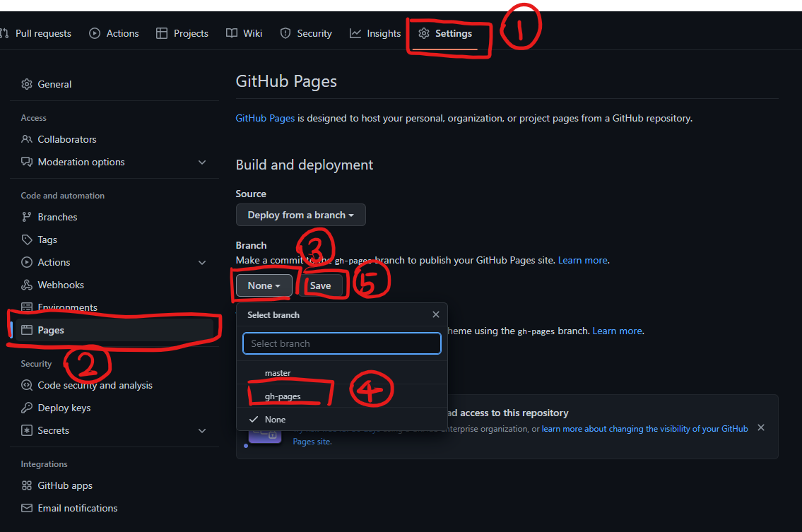
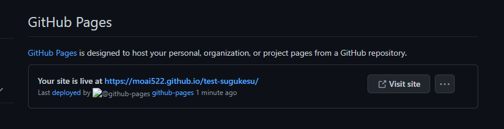

ページの見た目と大体の機能が完成したので、Storybook上ではなく実際のページとして表示してみましょう。
次のファイルを作成します。

## ディレクトリ構造

```
src
  └ index.jsx
```

内容は次のようになります。
```
import React from "react";
import ReactDOM from "react-dom";
import MainPage from "./components/Pages/MainPage";
import "./style.css";

ReactDOM.render(
  <MainPage />,
  document.getElementById("app")
);
```

これはhtmlファイル内のid="app"の要素の中にPages/MainPageを配置します。
index.htmlはpublicディレクトリの中に、読み込んでいるstyle.cssはsrcディレクトリの中にそれぞれ用意してあります。

ファイルの作成が出来たら、appディレクトリ下コマンド`yarn dev`を実行しましょう。
すると、http://localhost:8080 でアプリケーションが動いている様子が確認できると思います。

エラー処理とデータの保存を除いておよそお手本通りであったら、Github Pagesの設定を行ってから、
プルリクエストを出し、レビュー依頼をしてください。

## Github Pagesの設定

Github上のこの課題用のリポジトリのページを開き、以下の手順で設定を行います。



1. Settingsを開く
2. Pagesを開く
3. デプロイの対象となるブランチの指定をする。Branchのドロップダウンを開き、
4. gh-pagesブランチを選択する。このブランチはGithub Actionsにより自動で作成・更新される。**この時点でgh-pagesがリストに無かったら想定外なので講師に連絡してください。**
5. （新たに/root等が記載されたドロップダウンが出現するが無視して、）Saveボタンを押す

ここまで行い、一分程度待ってからページを更新すると、デプロイされたページへのリンクが出現します。



リンク先のページが、ローカルで`yarn dev`を実行した際のページと同じ挙動を示すことを確かめたら、このリンクを添付してプルリクエストを提出して下さい。

