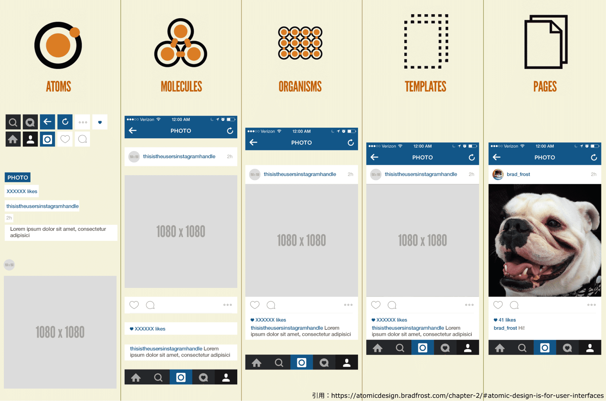

この課題では次のウェブアプリケーションを作成することを目標とします。

http://shinonome.io/frontend-basic-2022-todoapp/

実装に入る前にどういった機能があるのか実際に触って把握しておきましょう。

- タスクの追加ができる
  - 追加直後に名前の入力が可能となる
  - 名前を入力後Enterキーを押すか入力欄以外の部分をクリックすると、名前が決定される
  - 名前が空欄のまま決定するとアラートが表示されてタスクが消える
- 追加したタスクのチェックボックスを押すとタスクが完了状態となり消える
- 鉛筆マークを押すとタスク名を編集できる
- 追加したタスクは一回ページを閉じて再び開きなおしても保存されている

## Atomic Designを実装する

#### Atomic Designとは

Atomic Design(アトミックデザイン)とは、
画面を構成する要素を、`Atoms(原子)`,`Molecules(分子)`,`Organisms(有機体)`,`Templates(テンプレート)`,`Pages(ページ)`
の 5 つの階層に分け、最終的な UI と UI の基礎となるデザインシステムを同時に作成する設計方法です。

Atoms：抽象化レベルの最も低いAtomsは、UIデザインの最小単位です。
Atomsの例には、ボタン、アイコン、入力フィールドなどがあります。

Molecules：Moleculesは、Atomsを組み合わせたものです。
Moleculesの例には、フォーム、検索バーなどがあります。

Organisms：抽象化レベルの次の段階であるOrganismsは、
UIの特定のセクションを形成するAtoms,Moleculesの組み合わせです。
Organismsの例には、ヘッダー、フッターなどがあります。

Templates：Templatesは、特定のコンテンツと機能を表す実際のページやレイアウトです。
これらはOrganismsやその他のコンポーネントから構成されています。

Pages：Pagesは、Atomic Designの最終段階です。
これらは、Templatesやその他のコンポーネントから構成され、
最終的にユーザーが閲覧するウェブサイトまたはアプリケーションの画面です。

#### 利点

- 機能やコンポーネント単位で考えることで、デバイスやページの概念に縛られず、動的にデザインできること。
- それぞれの階層でコンポーネント化をすることによって修正・変更しやすく、パーツの使い回しもできる。

#### 例
以下の画像がinstagram を Atomic Design 化 したもの。

